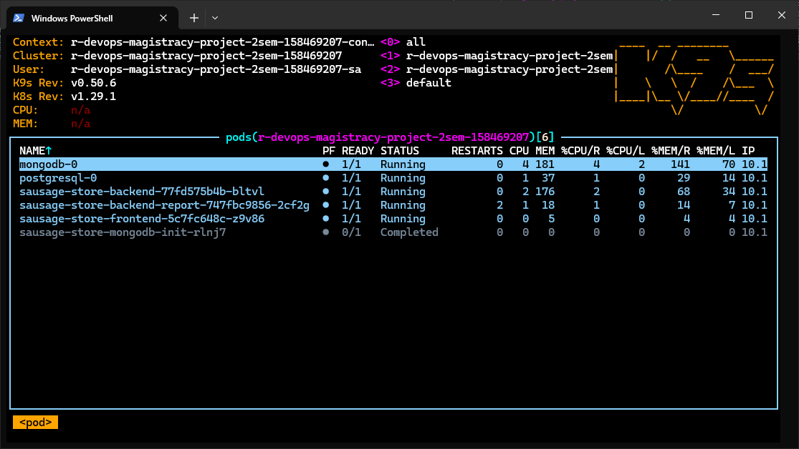
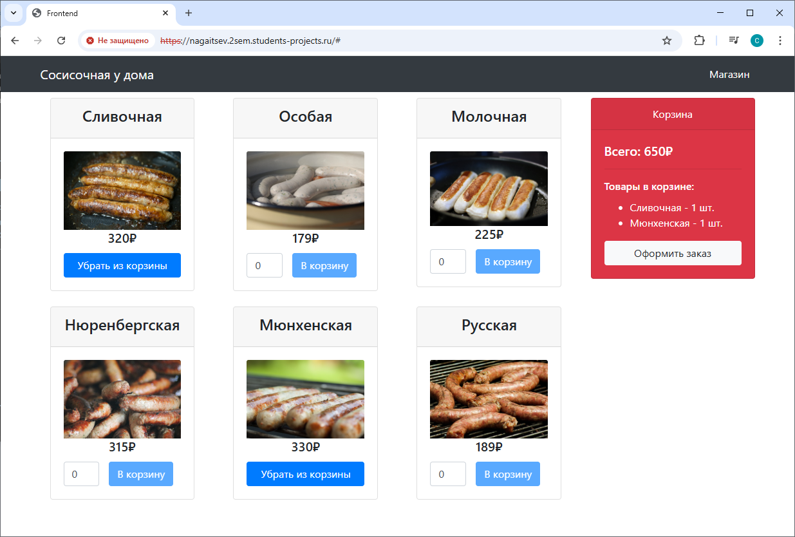

# Sausage Store Project

This repository contains the implementation of the second-semester research project — a microservice-based application called "Sausage Store", deployed on Kubernetes using Helm charts.


## Technologies used

* Frontend – TypeScript, Angular.
* Backend  – Java 16, Spring Boot, Spring Data.
* Database – H2.

## Installation guide
### Backend

Install Java 16 and maven and run:

```bash
cd backend
mvn package
cd target
java -jar sausage-store-0.0.1-SNAPSHOT.jar
```

### Frontend

Install NodeJS and npm on your computer and run:

```bash
cd frontend
npm install
npm run build
npm install -g http-server
sudo http-server ./dist/frontend/ -p 80 --proxy http://localhost:8080
```

Then open your browser and go to [http://localhost](http://localhost)


## Project Structure

```
.
├── README.md
├── backend
│   ├── Dockerfile
│   └── src
│       ├── main
│           ├── java
│           │   └── com
│           │       └── yandex
│           └── resources
│               └── db
│                   └── migration
│                       ├── V001__create_tables.sql
│                       ├── V002__change_schema.sql
│                       ├── V003__insert_data.sql
│                       └── V004__create_index.sql
├── backend-report
│   └── Dockerfile
├── frontend
│   └── Dockerfile
└── sausage-store-chart
    ├── charts
    │   ├── backend
    │   ├── backend-report
    │   ├── frontend
    │   └── infra
    └── values.yaml
```

## Features Implemented

### Backend
- Dockerfile for backend service
- Database migrations (PostgreSQL)
- Migrations are applied correctly
- LivenessProbe configured
- Deployment strategy: RollingUpdate
- Resource limits and requests defined (CPU & Memory)

### Backend-Report
- Dockerfile for backend-report service
- Deployment strategy: Recreate
- Horizontal Pod Autoscaler (HPA) configured
- Resource limits and requests defined

### Frontend
- Dockerfile for frontend service
- Added missing Service and Chart.yaml

### Infra
- PostgreSQL manifest with PVC for persistent data
- MongoDB deployment included in `infra` chart

### Helm Charts
- Top-level Helm chart (`sausage-store-chart`)
- Subcharts for each service: `frontend`, `backend`, `backend-report`, `infra`
- VPA configured for backend
- Templates use `.Values` from `values.yaml`
- Proper naming using Helm built-in variables like `.Release.Name`, `.Release.Namespace`
- Chart passes `helm lint`
- Successfully deployable via `helm install`
- Deployed services work as expected:
  - Frontend displays list of sausages
  - Orders can be placed


## How to Use

1. **Deploy to Kubernetes cluster**
   ```bash
   helm install sausage-store ./sausage-store-chart
   ```

2. **Verify deployment**
   ```bash
   helm list
   kubectl get pods,svc,ingress
   ```

3. **Access frontend**
   Open the frontend via Ingress or Service IP/Port.

## Screenshots

  


https://nagaitsev.2sem.students-projects.ru/  



--- 

## Advanced Task (Not Implemented)
## TODO

The following features were **not implemented** due to complexity or time constraints:
- [ ] Vault integration
- [ ] Secrets stored in Vault (e.g., DB credentials)
- [ ] Removal of sensitive values from Helm charts
- [ ] Spring Cloud Vault configuration in `application.properties`